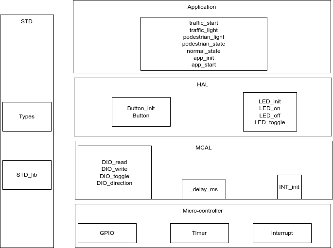
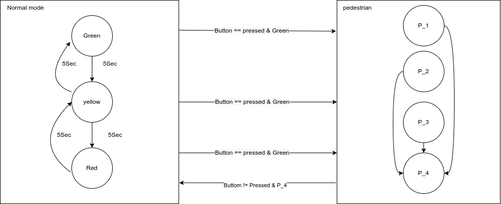

# architecture
 
Architecture is divided into 5 layers: 
1- micro-controller: prephiral that used from micro-controller  
2- MCAL: drivers for prephirals  
3- HAL: drivers for Interfaces  
4- STD: shared library between all layers that have basic types and operations. 
5- Application: state machine of the traffic application  

# State_machine
 